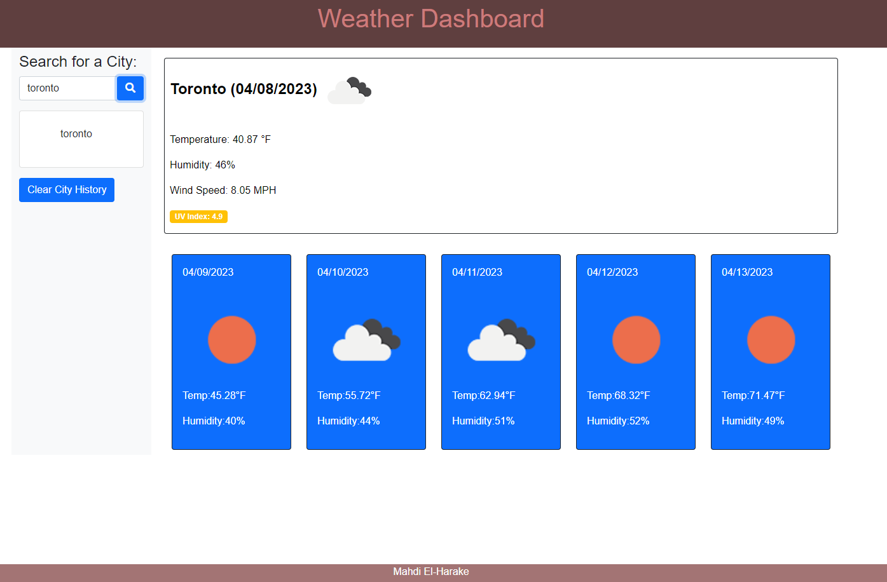

# MahdisWeatherDashboard

## Your Task

The goal of this application is to create a weather dashboard that will display the current weather for the searched city as well as the forecast for the next five days. It will also store in local storage and in searched history the past search results.

## User Story

```
AS A traveler
I WANT to see the weather outlook for multiple cities
SO THAT I can plan a trip accordingly
```

## Acceptance Criteria

```
GIVEN a weather dashboard with form inputs
WHEN I search for a city
THEN I am presented with current and future conditions for that city and that city is added to the search history
WHEN I view current weather conditions for that city
THEN I am presented with the city name, the date, an icon representation of weather conditions, the temperature, the humidity, and the wind speed
WHEN I view future weather conditions for that city
THEN I am presented with a 5-day forecast that displays the date, an icon representation of weather conditions, the temperature, the wind speed, and the humidity
WHEN I click on a city in the search history
THEN I am again presented with current and future conditions for that city
```

## Screenshot

The following image shows the web application's appearance and functionality:



## Installation

Github repository:

https://github.com/mahdi83777/MahdisWorkDayScheduler

Deployed application:

https://mahdi83777.github.io/MahdisWorkDayScheduler/

## References

[Day.js] (https://day.js.org/docs/en/parse/string-format)
[JS this] (https://www.w3schools.com/js/js_this.asp)
